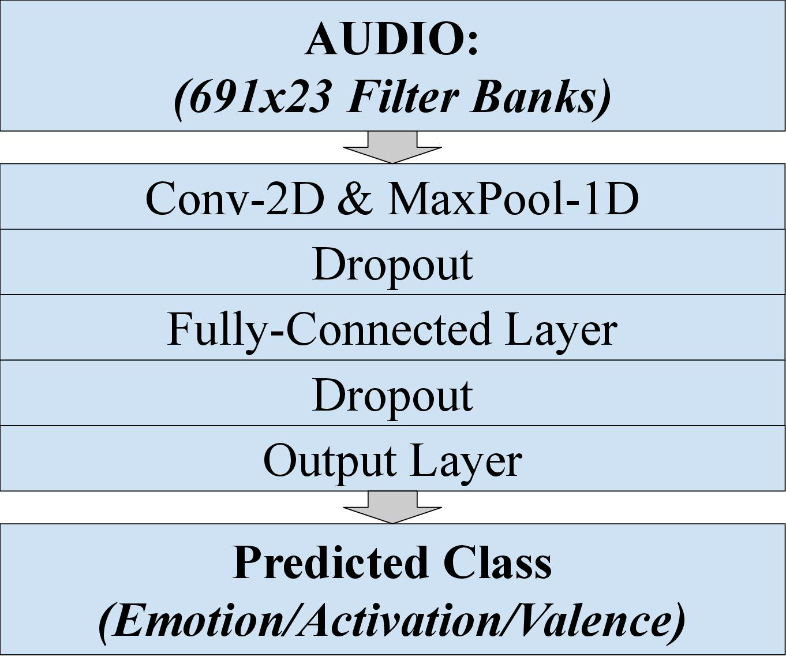
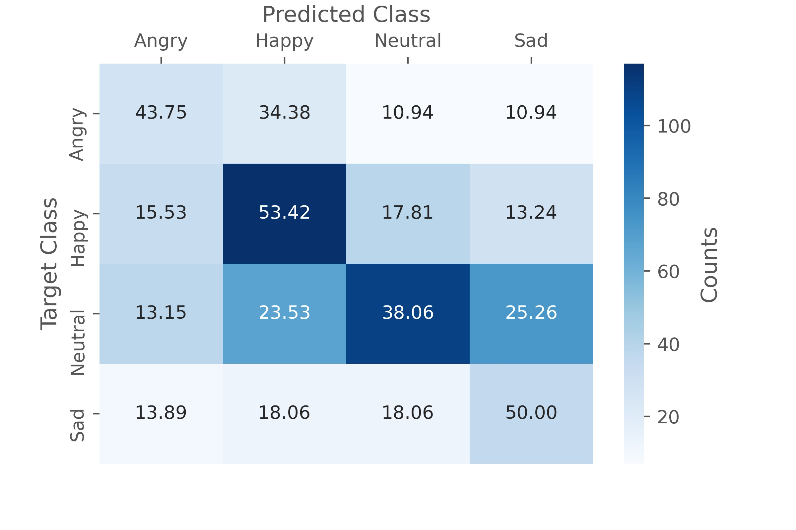
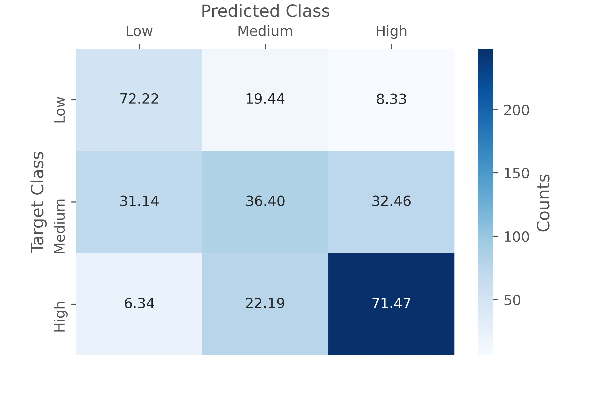
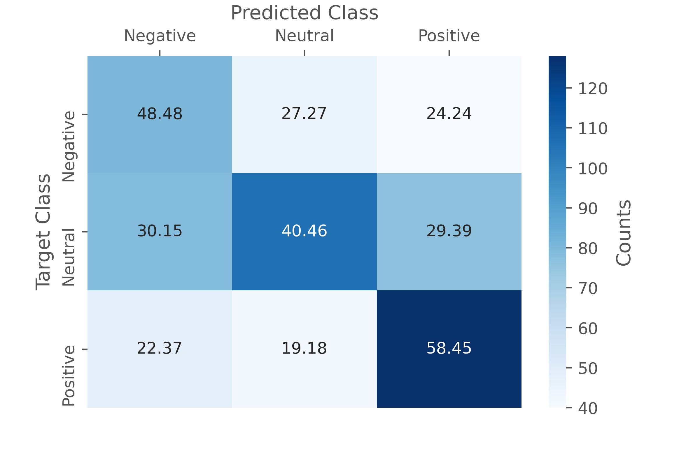

# emotion_recognition_from_speech

## Summary
The goal of this project is to train and evaluate a model that would be able to automatically recognize one of **4 emotion classes** _(Angry, Happy, Neutral, Sad)_ from a speech signal. Given the assumption that prosody is the main contrubutor to recognizing emotions from speech, all lexical content is disregarded in this project.
(Note: In addition to the **emotion class model** auxiliary models for **activation** and **valence** were trained.)

## Data
The data consistes of utterances from 12 speakers (6 female / 6 male) collected in 6 dyadic sessions. The vast majority of the data is assumed to be natural and not acted.

Emotion Class | Count | Percentage
------------ | ------------- | -------------
_Total_ | _7,798_ | _100.00%_
Angry | 792 | 10.16%
Happy | 2,644 | 33.91%
Neutral | 3,477 | 44.59%
Sad | 885 | 11.35%

## Feature Extraction
* Using Mel log filter banks as features (middle-ground between spectrograms with largre size / redundant information and MFCCs with a high leven of abstraction)
* Extracting features via Kaldi extension for torchaudio
* Combining features and labels into a pandas dataframe

## Preprocessing/Training/Evaluation
* Padding/cutting to a universal shape (mean nr of frames + std)
* Normalizing via Z-Score (mean=0; std=1)
* Using a CNN style architecture adapted to time continuous data. Takes a convolution over all features of one or several time steps resulting in a one-dimensional movement of the kernel which corresponds to the movement along the time dimension
* Performing training/evaluation in a 6-fold cross validation approach

## Model Architecture

  

## Evaluation Results
|Emotion Class|
|:-------------------------:|
||

Activation             |  Valence
:-------------------------:|:-------------------------:
  |  

